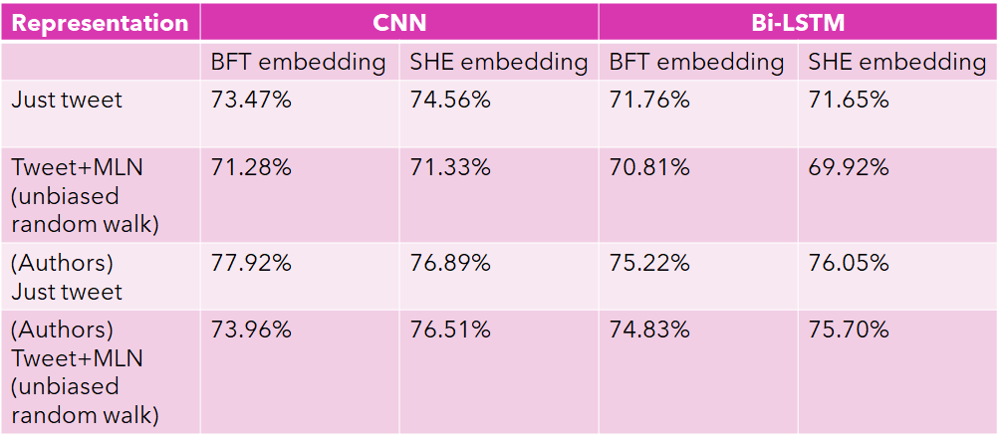

# SA-w-MHN
Implementation of sentiment analysis with multilayer heterogenous networks (see paper in EMNLP 2020 proceedings pgs 8932–8946)
## Prerequisites
Make sure you have installed all of the following prerequisites on your development machine:
* python 3.8
* gensim 3.8
* tensorflow (latest)
* numpy (latest)
* pandas (latest)
* nltk (latest)
* networkx (latest)
* editdistance (latest)
* emoji (latest)
## Files
The purpose of each file in the modules folder is as the following :
* Preprocessor.py: This file is repsonsible for cleaning the tweets and removing Unnecessary words and punctuation  
* GraphGenerator.py : This file is responsible for implementing the first stage in the framework. This file is used to create a multilayer network represented as a graph with 3 layers; keywords, hashtags, and mentions.
* RandomWalks.py: This file contains the implementation of MultiRank. Furthermore, this file is responsible for Calculating 3 Random Walk seqeunces. 
* ML_Models.py : This file contains the implementation of CNN and Bi-Lstm models. Furthermore, this file is also reponsible for conducting the experiments.
<h4>Proposed framework</h4>

## Results 

